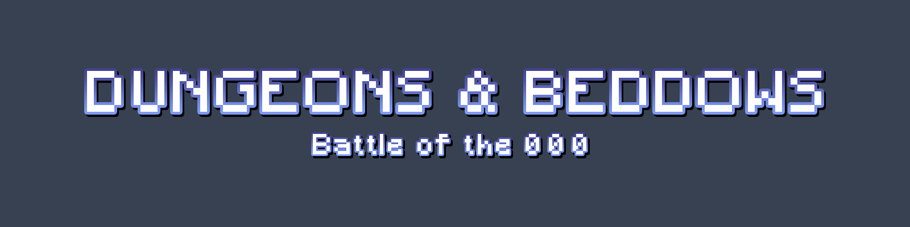

# Dungeons & Beddows: Battle of the 0 0 0

# Introduction

Dungeons & Beddows is a turn-based RPG game built on Lisk technology. It was developed as an entry for the [HackOnLisk2](https://hackonlisk2.devpost.com) event (GameFi category).

In this game you go on an adventure to slay monsters, level up, earn gold, get better gear, run into random events, and much more.

# Compatibility

For the time being the game is optimized for desktop browsers only.

Recommended browser: Any Chromium based (Chrome, Brave, Edge, etc).

# Additional Information

If you would like to run the game locally, please refer to the documentation below:

- [Backend setup](./backend/README.md)
- [Frontend setup](./frontend/README.md)

# License

[MIT](./LICENSE)
